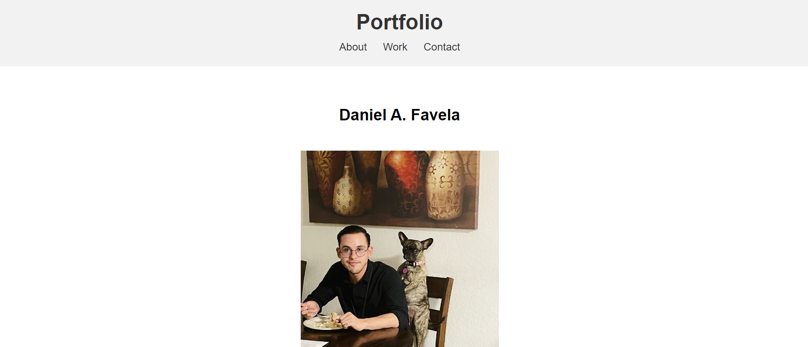

# <exposition-introduction>

Portfolio Website. 

## Description

The goal was to build a portfolio page to showcase skills and talents of an employer who is looking to fill a part-time or full-time position. Skills like flexbox, media queries, and CSS variables, are used in this project. 

## Table of Contents (Optional)

- [Installation](#installation)
- [Usage](#usage)
- [Credits](#credits)
- [License](#license)

## Installation

N/A. This is a website which is accessible with internet connection an a browser navigator. 

## Usage

Users are able to access the developer's information and use the navigation feature of the website to access the "about me", "work" and "contact" sections of the page. The user should see a a picture of the developer on the "about me" section with a paragraph written under it, pictures and links to the developer's projects on the "work" section, and 4 items with the developer's contact information on the "contact"section" of the page.  

## Credits

https://www.w3schools.com/html/html5_semantic_elements.asp

https://web.dev/learn/html/semantic-html/

https://www.w3schools.com/cssref/css3_pr_mediaquery.php

https://developer.mozilla.org/en-US/docs/Web/CSS/CSS_media_queries/Using_media_queries

https://www.w3schools.com/cssref/sel_hover.php

https://developer.mozilla.org/en-US/docs/Web/CSS/:hover

https://www.youtube.com/watch?v=_GTMOmRrqkU&t=1483s

## License

Please refer to the license in the repo.

